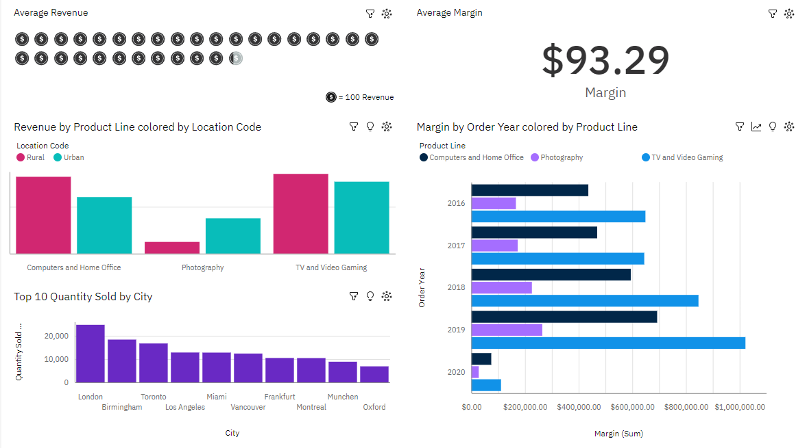

# Sales Dashboard Cognos Analytics
## Scenario
I am a data engineer at an e-commerce company. My company has finished setting up a data warehouse. Now i am assigned the responsibility to design a reporting dashboard that reflects the key metrics of the business.

## Objectives
In this assignment i will:
- Create a dashboard using Cognos Analytics

## Result
You can see the result live directly from IBM Cognos Analytics.

  

